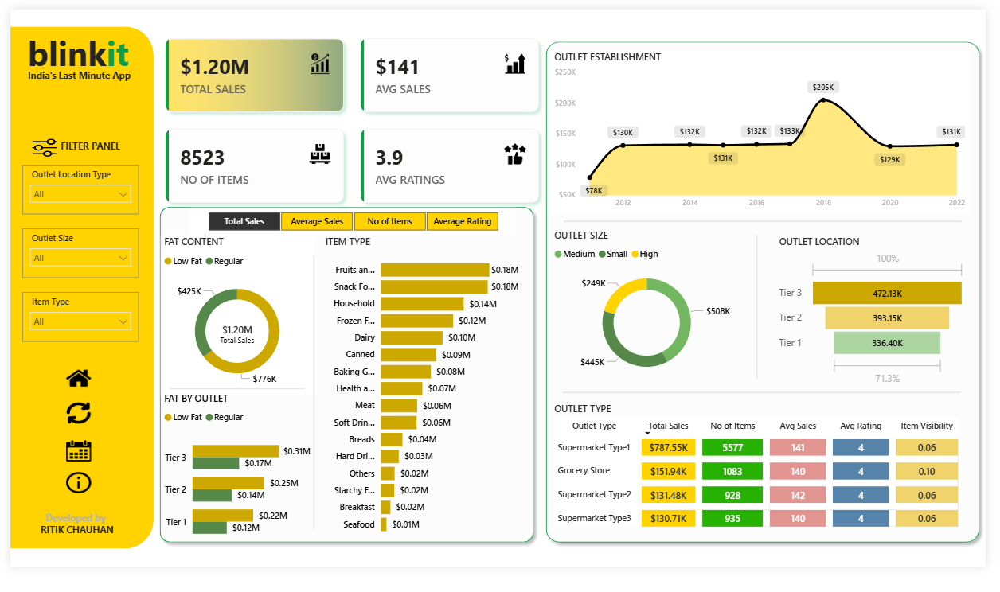

# Blinkit Sales Dashboard | Power BI

## Project Overview

This project is an interactive Power BI dashboard developed to analyze Blinkit's sales performance across different outlet types, locations, and product categories. The dashboard provides key business insights through data visualization, KPI tracking, and trend analysis.

## Project Objective

To analyze sales performance and customer behavior across Blinkit's retail network and identify factors influencing revenue, product demand, outlet performance, and customer satisfaction.

## Dashboard Preview

## Key Performance Indicators (KPIs)

| KPI             | Value  |
| --------------- | ------ |
| Total Sales     | $1.20M |
| Average Sales   | $141   |
| Number of Items | 8,523  |
| Average Rating  | 3.9    |

## Dashboard Features

* Sales analysis by product category
* Outlet performance comparison
* Outlet size distribution analysis
* Location-wise sales analysis
* Fat content segmentation
* Outlet establishment trend analysis
* Interactive filtering and drill-down capabilities

## Key Business Insights

* Tier 3 outlets generated the highest overall sales.
* Fruits & Vegetables and Snack Foods emerged as top-performing categories.
* Regular-fat products contributed a significant portion of total revenue.
* Supermarket Type 1 outlets demonstrated the strongest sales performance.
* Sales trends varied considerably across outlet sizes and locations.

## Tools & Technologies

* Power BI
* Power Query
* DAX (Data Analysis Expressions)
* Microsoft Excel

## Files Included

* `Blinkit_Sales_Dashboard.pbix` – Power BI Dashboard
* `Blinkit_Data.xlsx` – Dataset
* `dashboard.png` – Dashboard Preview
* `README.md` – Project Documentation

## Skills Demonstrated

* Data Cleaning & Transformation
* Data Visualization
* Dashboard Development
* KPI Design & Tracking
* Business Intelligence Reporting
* Data Analysis

## Conclusion

This project demonstrates the use of Power BI for transforming raw business data into meaningful insights that support data-driven decision-making.
